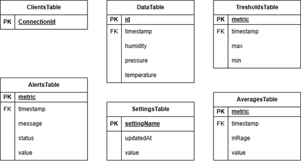

# IoT Environmental Monitoring System

## Overview

This project implements a real-time environmental monitoring system for storage condition control (temperature, humidity, pressure).

The system follows a scalable client-server architecture consisting of:

- **ESP32 edge device** (data acquisition)
- **AWS serverless backend** (processing & storage)
- **React web client** (real-time visualization)

The architecture is event-driven, modular, and designed for real-time processing.

---

## System Architecture

### 1️. ESP32 – Data Acquisition Layer

- Reads environmental data from two **BME280 sensors** via I²C  
- Calculates timestamps locally  
- Sends structured JSON messages via WebSocket  
- Uses GSM (GPRS) connectivity for autonomous internet access  

Example message:

```json
{
  "action": "msg",
  "type": "sensor",
  "body": [
    {
      "id": 1,
      "timestamp": 1715023830,
      "temperature": 23.4,
      "humidity": 41.2,
      "pressure": 1007.3
    }
  ]
}
```

---

### 2️. Cloud Backend - AWS Lambda + DynamoDB

Implemented using:

- AWS Lambda (TypeScript)
- API Gateway WebSocket
- Amazon DynamoDB

The backend:

- Validates incoming sensor data  
- Retrieves threshold configuration  
- Calculates average values from both sensors  
- Determines whether values are within allowed range  
- Stores processed results in DynamoDB  
- Broadcasts updates to connected WebSocket clients  

Average values are stored together with a boolean `inRange` flag to support alert logic.

---

## Database Design

The system uses multiple DynamoDB tables with clear separation of responsibility:

- **ClientsTable** – active WebSocket connections  
- **DataTable** – raw sensor data  
- **AveragesTable** – computed average values  
- **ThresholdsTable** – configurable parameter limits  
- **AlertsTable** – alarm events (out-of-range / back-to-normal)  
- **SettingsTable** – authentication and SMS configuration



---

## Web Client – React

The frontend provides:

- Live data visualization  
- Real-time updates via WebSocket  
- Threshold configuration  
- Historical data retrieval  
- CSV export of averaged values  

---

## Key Features

- Real-time environmental monitoring  
- Dual-sensor averaging logic  
- Threshold-based alert state handling  
- Event-driven serverless backend  
- Modular service-based architecture  
- WebSocket real-time communication  
- GSM-based autonomous connectivity  

---

## Technologies Used

- ESP32 (C++)
- BME280 sensors
- GSM / GPRS
- AWS Lambda (TypeScript)
- Amazon DynamoDB
- API Gateway WebSocket
- React + TypeScript

---

## Design Principles

- Event-driven architecture  
- Separation of concerns  
- Modular backend services  
- Real-time data processing  
- Scalable cloud-based system  

---

This project demonstrates practical experience with embedded systems, cloud integration, real-time data processing, and structured backend architecture suitable for industrial monitoring and control environments.


